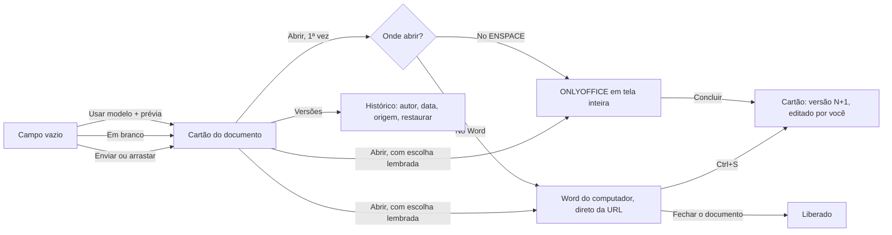

# Decisões: editor de documentos

## A proposta, em 6 pontos

1. **O campo vira um cartão que conta o que acontece com o documento.** Miniatura, nome, versão, quem editou por último e quando, e quem está com ele agora (e onde). Substitui o botão sem contorno "Abrir Documento" e o chip genérico do develop.
2. **O campo vazio é a própria área de começar.** Usar modelo (com prévia preenchida com os dados do item), Em branco e Enviar arquivo, ou arrastar o arquivo para o cartão. Substitui "Subir documento" → gaveta → upload → "Usar modelo" → "Tem certeza?".
3. **Abrir com escolha de editor, perguntada 1 vez.** "No ENSPACE" (ONLYOFFICE) ou "No Microsoft Word". Com "Lembrar minha escolha", o botão passa a dizer o editor ("Abrir no Word"), e a seta ao lado troca.
4. **Word de verdade, direto do item.** O Word do computador abre o arquivo pela URL do ENSPACE (`ms-word:ofe|u|...`), sem baixar. O documento fica reservado para quem abriu; o Ctrl+S grava no item e vira versão; fechar libera.
5. **ONLYOFFICE em tela inteira, com moldura do ENSPACE.** Cabeçalho fixo com item, campo, estado de salvamento sempre visível, quem está editando, Versões ao lado, Baixar, Abrir no Word e Concluir. Esc fecha só o que está por cima.
6. **Configuração do campo em 3 grupos.** Onde abre (ONLYOFFICE, Word, Word para a web como fase 2, editor padrão), como nasce (modelos, em branco, .docx, .pdf) e o que se faz no editor (editar ligado por padrão).

## A jornada

## A limitação técnica, decidida

- **Word instalado (Windows e Mac): caminho principal.** WebDAV com bloqueio + `ms-word:ofe`. Não depende da Microsoft.
- **Saída de emergência (rodada 4):** se o Word não abrir, baixar o arquivo, editar no Word ou onde a pessoa quiser e enviar de volta; o envio vira versão nova e libera a reserva.
- **Word para a web: fase 2**, ligado por padrão no protótipo para a opção aparecer (rodada 5). Cópia no OneDrive pelo Microsoft Graph. O CSPP fica de fora: obriga o Office como editor padrão.
- **Painel do suplemento:** ganha a aba "Documento" (item, campo, versão aberta, mudança não salva, Salvar no ENSPACE, Concluir e liberar). Não abre sozinho na versão da loja: a Microsoft só permite isso em implantação centralizada ou sideload.
- Detalhe e fontes: `PESQUISA.md`, "A limitação técnica".

## Rodada 1 · 2026-10-08
- **Pedido (literal):** "a ideia é permitir que, na interação com o campo, o usuário possa escolher se quer usar o onlyoffice ou o word. e trabalhar no word com o doc dele. [...] prototipe a solução e aproveite para melhorar o VISUAL do campo que hoje é horrível. pode propôr melhorias até no visual da interação com onlyoffice tambem."
- **Pedido (literal, no meio da rodada):** "olha o botao sem contorno algum depois que sobe documento... tem muito detalhe ruim de ux/ui pra voce prestar atençao e resolver com /nuxt-ui"
- **Pedido (literal, no meio da rodada):** "voce tem que fazer o comportamento do prototipo simular o real e funcionar na minha maquina, ok? com arquivo que eu nao tenho salvo aqui. como seria o caso do usuario real"
- **Mudou:** protótipo novo, em `app/pages/editor-de-documentos/`.
- **Mudou:** o "Abrir no Word" chama o Word do computador de verdade, com um .docx que mora no endereço do protótipo (`arquivos/`, gerado por `gerar-arquivos.py`), não no computador de quem abre.
- **Mudou:** cada componente saiu da skill e do MCP `nuxt-ui`: UFileUpload (área de soltar), UFieldGroup + UDropdownMenu (botão com seta), URadioGroup card (escolha do editor), UTimeline (versões), UModal fullscreen (editor), USlideover (visão rápida, versões, configuração). Nenhum CSS próprio.
- **Fronteira:** muda o campo Editor de Documentos (vazio, preenchido, estados), a escolha do editor, a moldura do ONLYOFFICE, o fluxo do Word, o painel do suplemento (aba Documento), as versões, a configuração do campo e a célula do campo na lista. Muda também o aviso "Alterações não salvas" do rodapé da visão rápida, que só aparece com mudança (o documento não passa pelo Salvar do item). Não muda o resto da casca: menu, topo, trilha, abas, lista, trilho de ícones, campos comuns.
- **Descartado:** "Tela cheia" do navegador. Motivo: o editor já nasce em tela inteira dentro do ENSPACE, com contexto.
- **Descartado:** CSPP para o Word para a web. Motivo: obriga o Office como editor padrão e exige aprovação, seguros e coautoria.
- **Descartado:** abrir o painel do suplemento sozinho com o documento. Motivo: a Microsoft não permite para suplemento da loja.
- **Não deu:** salvar de volta no item a partir do Word real. Por quê: exige o endpoint WebDAV, e o protótipo não tem servidor (regra 4). O Word abre o arquivo em leitura, e isso prova o ponto técnico.
- **Não deu:** abrir no Word um arquivo enviado pela pessoa no protótipo. Por quê: ele vive como `blob:` no navegador, que o Word não alcança; o protótipo baixa o arquivo (a saída de emergência).
- **Não deu:** prints das referências. Por quê: a pesquisa foi por leitura de documentação; as URLs estão no `PESQUISA.md`.
- **Não deu:** conferir na tela da Mikaela que o Word abriu. Por quê: o acesso à tela foi recusado; conferi que o arquivo responde no endereço e que o link `ms-word:` é montado com ele.
- **Simulação:** a área do ONLYOFFICE (barra e página desenhadas; dá para digitar e ver o salvamento); a janela do Word, chamada na tela de "simulação do plugin do Word" (cinza, sem identidade da Microsoft; o painel e o salvamento no item são proposta); a geração por modelo, o envio e o salvamento (simulados em memória); a miniatura (linhas, no lugar da imagem da 1ª página); Baixar como PDF; "Como instalar" o suplemento. Nada usa localStorage; recarregar zera tudo.
- **Crítica e acessibilidade:** passada de crítica feita com a skill `design:design-critique`; a de acessibilidade foi feita junto, no mesmo roteiro (contraste, foco, rótulos), sem rodar a skill `design:accessibility-review` à parte.
  - Corrigido: o texto "formatos aceitos" usava `text-dimmed`, baixo contraste; passou a `text-muted`.
  - Corrigido: documento criado em branco mostrava o texto do contrato.
  - Corrigido: a transição do campo travava porque o UFileUpload não tem raiz única.
  - Ficou: o botão Salvar da visão rápida desabilitado se diferencia pouco do habilitado (opacidade padrão do Nuxt UI).
  - Ficou: o "Abrir" do campo e o "Salvar" do rodapé usam a mesma cor primária. A ação do campo precisa de peso; o Salvar só acende com mudança.
  - Ficou: a miniatura tem rótulo de 8 px ("DOCX"); é decorativa (`aria-hidden`), e o tipo também aparece no texto ao lado.
  - Ficou: o andaime quebra em 2 linhas em telas de até 1.600 px; é andaime.
  - A conferir à mão: na automação, o 1º clique logo depois de fechar o editor ou um modal foi ignorado algumas vezes. A janela do Chrome estava em segundo plano em parte dos testes, o que também descarta clique; não deu para separar as 2 causas.
- **Ver:** `http://localhost:3000/editor-de-documentos` · `evidencias/proto-*.jpg`

## Rodada 2 · 2026-10-08
- **Pedido (literal):** "voce tem que deixar explicado no prototipo que o user tem que clicar em \"maquete\" pra ver como seria a aprencia do plugin. nao é maquete, bote \"simulaçao plugin word\" ou algo assim."
- **Mudou:** o botão do modal Abrir no Word passou de "Ver o painel do ENSPACE (maquete)" para "Ver simulação do plugin do Word".
- **Mudou:** o modal explica, depois que o Word abre, que esse botão mostra como o plugin aparece dentro do Word.
- **Mudou:** o cartão do campo reservado ganhou o botão "Simulação do plugin"; "Voltar ao Word" só chama o Word do computador.
- **Mudou:** a dica do andaime diz o caminho até a simulação e aparece em qualquer largura de tela.
- **Mudou:** "maquete" saiu de todo texto de tela (aviso da janela, área do ONLYOFFICE, toasts), nos 3 idiomas; os toasts que estavam fixos em português passaram para o `textos.ts`.
- **Fronteira:** muda só o texto e o acesso à simulação; não muda o fluxo nem a proposta.
- **Ver:** `http://localhost:3000/editor-de-documentos` · `evidencias/proto-03-abrir-no-word.jpg`, `proto-04-painel-do-enspace-no-word.jpg`, `proto-08-cartao-com-simulacao-do-plugin.jpg`

## Rodada 3 · 2026-10-08
- **Pedido (literal):** "voce fez estados diferentes em itens diferentes. deixe os estados como possiveis de mudar na barra de gferramentas do prototipo [...] ou só diminua o número de itens deixando 1 pra cada cenario especifico. essa segunda opçao parece ate melhor"
- **Mudou:** a lista tem 6 contratos, 1 por cenário: sem documento, DOCX com 1 versão, DOCX com 7 versões, PDF, outra pessoa no Word, editando junto no ENSPACE.
- **Mudou:** o andaime ganhou o seletor "Cenário", que abre o contrato daquele cenário e marca qual está aberto.
- **Mudou:** o campo é montado de novo a cada contrato (`:key` por item), para o "Avisar quando liberar" e a criação em andamento não passarem de um contrato para outro.
- **Mudou:** saíram os contratos CTR-0131, CTR-0128 e CTR-0126 e os .docx deles; o CTR-0142 ficou com 1 versão.
- **Fronteira:** muda só o mock e o andaime; não muda o campo, os editores nem a casca.
- **Não deu:** print novo. Por quê: a janela do Chrome estava em segundo plano e o print não sai; conferi os 6 cenários pelo conteúdo da página.
- **Ver:** `http://localhost:3000/editor-de-documentos`

## Rodada 4 · 2026-10-08
- **Pedido (literal):** "nesta parte, se o word nao abrir, a orientaçao simplesmente deve ser de a pessoa baixar, editar no word ou onde quiser, e subir de novo. e aí deve ter o botao de baixar e o de fazer upload ao lado. falta isso"
- **Mudou:** "O Word não abriu?" diz: "Baixe o arquivo, edite no Word ou onde preferir e envie de volta. O arquivo enviado vira uma nova versão deste item."
- **Mudou:** os botões Baixar e Enviar nova versão ficam lado a lado. Baixar baixa o .docx do item de verdade; Enviar nova versão abre o seletor de arquivo (.docx), cria a versão com origem "Arquivo enviado" e libera a reserva.
- **Descartado:** a orientação de usar o painel do suplemento na cópia baixada. Motivo: pedido da rodada; baixar e enviar não depende de plugin nenhum.
- **Fronteira:** muda só a saída de emergência do modal Abrir no Word.
- **Ver:** `http://localhost:3000/editor-de-documentos`, cenário "DOCX, 1 versão", Abrir no Word, "O Word não abriu?"

## Rodada 5 · 2026-10-08
- **Pedido (literal):** "por padrao deixe ativado pra aparecer a opçao do word web tambem. e coloque a barra de ferramentas do prototipo na parte inferior, nao superior como ta hj"
- **Mudou:** a chave "Word para a web (fase 2)" da configuração do campo nasce ligada; a opção aparece na seta do botão Abrir e na pergunta "Onde você quer abrir?".
- **Mudou:** a barra do protótipo (andaime) passou para a parte de baixo da tela.
- **Mudou:** a casca passou a ocupar só a altura que sobra (antes usava a tela inteira e cobria o andaime embaixo); o menu da seta ficou mais largo para não cortar "Microsoft 365".
- **Fronteira:** muda o padrão da configuração e o lugar do andaime; não muda o fluxo.
- **Ver:** `http://localhost:3000/editor-de-documentos` · `evidencias/proto-09-andaime-embaixo.jpg`

## Achados do develop que não são desta demanda
- Abrir a configuração do campo deu "Ocorreu um erro ao carregar os campos aninhados" até clicar em Recarregar.
- Salvar o item gravou "R$ 0" num campo Valor Monetário que estava vazio.
- No workspace de exploração, ativei 4 chaves do campo `vitrine_documento` (categoria `leve`) e subi um .docx fictício num item. Ficaram assim.
